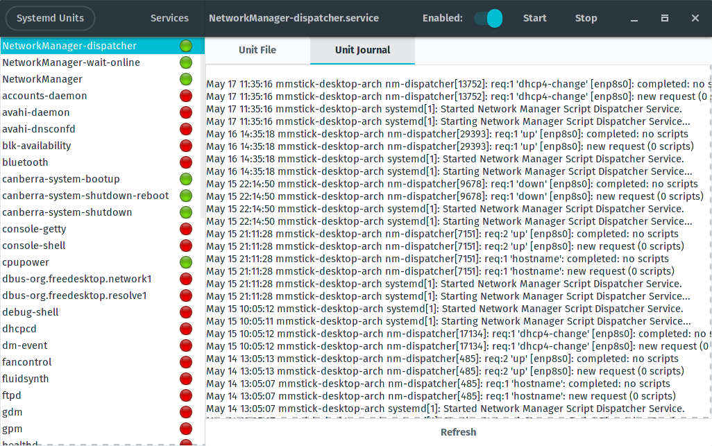

**Build Status:** [](https://travis-ci.org/mmstick/systemd-manager)

# Systemd Manager

This application exists to allow the user to manage their systemd services via a GTK3 GUI. Not only are you able to make changes to the enablement and running status of each of the units, but you will also be able to view and modify their unit files, check the journal logs. In addition, systemd analyze support is available to display the time it takes for systemd to boot the system.

## Screenshots





## Install Instructions

### Arch Linux

This is available in the AUR as a git package: [`systemd-manager-git`](https://aur.archlinux.org/packages/systemd-manager-git/).

### Ubuntu & Everyone Else

For Ubuntu users, this will automatically install libgtk-3-dev, generate a `systemd-manager` Debian package and automatically install it. For everyone else, it will simply install directly to the /usr prefix.

Simply install Rust via [multirust](https://github.com/brson/multirust) or [rustup.rs](https://www.rustup.rs/) and execute the _install.sh_ script.

```sh
curl https://sh.rustup.rs -sSf | sh
./install.sh
```

### Older versions

It is possible to run it on older GTK versions (3.10) but not all features will be available. To build it with GTK 3.10, you have to do:

```shell
cargo run --no-default-features
```

And to use Gtk 3.14:

```shell
cargo run --no-default-features --features gtk_3_14
```
