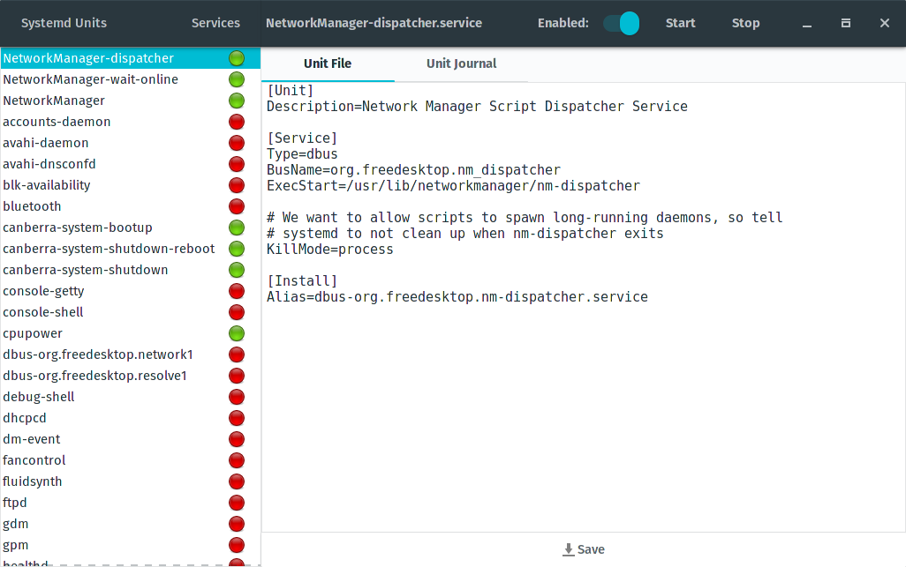

**Build Status:** [](https://travis-ci.org/mmstick/systemd-manager)

# Systemd Manager

This application exists to allow the user to manage their systemd services via a GTK3 GUI. Not only are you able to make changes to the enablement and running status of each of the units, but you will also be able to view and modify their unit files, check the journal logs. In addition, systemd analyze support is available to display the time it takes for systemd to boot the system.

## Screenshots




## Install Instructions

Simply install Rust via [multirust](https://github.com/brson/multirust) and execute the _install.sh_ script. For Ubuntu users, this will automatically install libgtk-3-dev, generate a `systemd-manager` Debian package and automatically install it. For everyone else, it will simply install directly to the /usr prefix.

```sh
./install.sh
```
